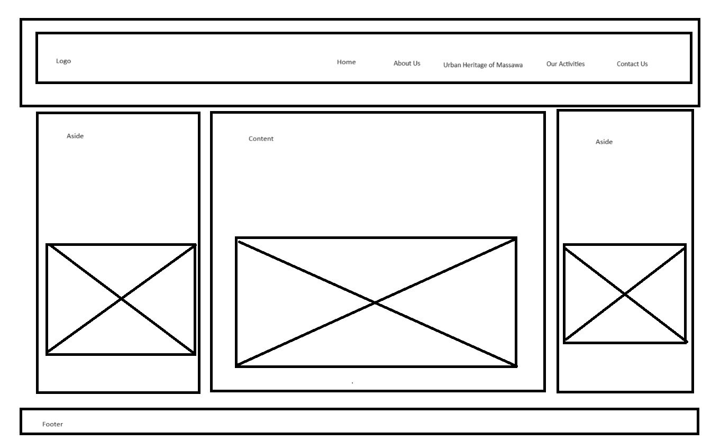

# project-1
This project is about the Urban Heritage of Massawa. An Eritrean civil initiative that seeks to document and protect the urban heritage of the ancient city of Massawa and spread awareness about it.
The goals of the project are:
- It is intended to be informative especially for Eritreans in the diaspora in general and the new generation born in exile
- Gathering information about the old city of Massawa and the most important historical buildings to be protected
- It is also intended to be a documentary site that documents all related materials, images, videos, and publication

Wireframe Below is the design I have chosen to build the site. The design is consistent throughout the site. The site has five pages: Home, About Us, the Urban Heritage of Massawa, Our Activities and Contact Us.

Wireframe Below is the design I have chosen to build the site. The design is consistent throughout the site. The site has five pages: Home, About Us, the Urban Heritage of Massawa, Our Activities and Contact Us.

## Features
The main feature of the website is its simplicity.
- As a user, I need to navigate through the website easily. The horizontal, fixed text-based navigation bar makes it possible.
- As a user I need to contact the administration of the website in case I need to reach them, having the contact us in the navigation bar makes it easier to get in touch with them.
- As a user, I need more options to get in touch with the initiative, and the possibility of using the E-mail address or Facebook makes it easier.
- As a user, I need to see consistency throughout the website, choosing a few colors and using them throughout the website gives me this consistency.

### Existing Features in each page 

- __Navigation Bar__

  - This section will allow the user to easily navigate from page to page across all devices without having to revert back to the previous page via the ‘back’ button.

![Nav Bar]

__Content, aside2 and aside2__
- Here the user will find different text and facts about Massawa as a city, its location and histtry and the urban heritage initiative

__Index__
  Index:
- The home page shows the site name with a logo of the civil initiative of Massawa Urban Heritage called AKAN and a welcome text in the top left of the web page.
- To the right a horizontal, fixed text-based navigation bar with a hover effect with five main pages.

- __About us:__

  - The club ethos section will allow the user to see the benefits of joining the Love Running meetups, as well as the benefits of running overall.
  - This user will find more information about the initiative and its goals.

- __Urban Heritag of Massawa__

  - This section will allow the user to see 

- __The contact us__ 

  - The footer section includes links to the relevant social media sites for Love Running. The links will open to a new tab to allow easy navigation for the user. 
  - The footer is valuable to the user as it encourages them to keep connected via social media

- __Gallery__

  - The gallery will provide the user with supporting images to see what the meet ups look like.
  - This section is valuable to the user as they will be able to easily identify the types of events the organisation puts together.

- __The Sign Up Page__

  - This page will allow the user to get signed up to Love Running to start their running journey with the community. The user will be able specify if they would like to take part in road, trail or both types of running. The user will be asked to submit their full name and email address.

For some/all of your features, you may choose to reference the specific project files that implement them.

In addition, you may also use this section to discuss plans for additional features to be implemented in the future:

## Testing 

### Validator Testing

- HTML
  - No errors were returned when passing through the official 
  1. Index
  https://validator.w3.org/nu/?doc=https%3A%2F%2Fomerahm69.github.io%2Fproject-1%2F
  2. About us
  [W3C validator](https://validator.w3.org/nu/?doc=https%3A%2F%2Fomerahm69.github.io%2Fproject-1%2Fabout-us.html)
3. Urban heritage of Massawa
   [W3C validator](https://validator.w3.org/nu/?doc=https%3A%2F%2Fomerahm69.github.io%2Fproject-1%2Furban-heritage-of-massawa.html)

    4. Our activities
   [W3C validator](https://validator.w3.org/nu/?doc=https%3A%2F%2Fomerahm69.github.io%2Fproject-1%2Four-activities.html)

    5. Contact Us
    [W3C validator](https://validator.w3.org/nu/?doc=https%3A%2F%2Fomerahm69.github.io%2Fproject-1%2Fcontact-us.html)

- CSS
  - No errors were found when passing through the official [(Jigsaw) validator]( https://jigsaw.w3.org/css-validator/validator?uri=https%3A%2F%2Fomerahm69.github.io%2Fproject-1%2Fassets%2Fcss%2Fstyle.css&profile=css3svg&usermedium=all&warning=1&vextwarning=&lang=en)

  Accessibility Testing

### Unfixed Bugs
-Bugs due to the types of images affected the loading time and this has been solved by converting the images to the web instead of the PNG

## Deployment
Fork
    1. On Github.com, navigate to the 
    2. In the top-right corner of the page, click Fork
    3. By default, forks are named the same as their parent repositories. You can change the   name of the fork to distinguish it further
    4. Add a description to your fork
    5. Click Create to your fork

Clone
    1. Above the list of files click the button that says 'Code'
    2. Copy the URL for the repository.
    3. Open Terminal. Change the directory to the location where you want the cloned directory
    4. Type git clone, and paste the URL https://omerahm69.github.io/project-1/
    5. Press Enter

Local Deployment
    1. Sign up to Gitpod
    2. Download the Gitpod browser extension.
    3. On GitHub.com, navigate to the
    4. Above the list of files click the button that says's 'Gitpod'

Remote Deployment
    The site was deployed to the GitHub pages. If you have forked or cloned the repository the steps to deploy are:
    
    1. On GitHub.com, navigate to your repository 
    2. Navigate to the settings tab
    3. Click on the tab called 'pages' on the left-hand side
    4. From the source drop-down list under the heading Build and Deployment, select main.
    5. The page will then provide the link to the website https://omerahm69.github.io/project-1/

## Credits 

### Content 
- The process from the Code Institute Love Running project was used to help create this website- CI Love Running
- HTML,CSS code help was taken from w3schhols-W3Schools

- I also make use of Learning Web Design, 5th Edition
  A Beginner's Guide to HTML, CSS, JAVASCRIPT, AND WEB GRAPHICS
 

### Media

- Images are from the AKAN initiative, an Eritrean civil initiative for the Urban Heritage of Massawa

 
